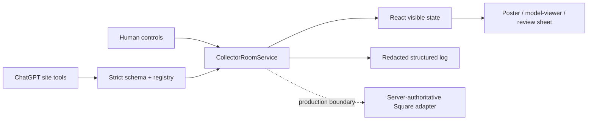

# Collector’s Room architecture

## Shared-state design

Manual controls and WebMCP tools call the same `CollectorRoomService`. The service owns a monotonic revision, allowlisted configuration, temporary reviews, visible activity history, and Undo snapshots.

The public challenge app does not implement `P`. Its `open_square_checkout` tool validates the exact current review, records the visible result, and returns `handoff_mode: review_only` without a fetch or navigation.

## State invariants

- Revision starts at 1 and increases on every visible mutation, including Undo.
- Each mutating input carries the revision the agent observed. A mismatch fails closed with `stale_state`.
- Selecting another artwork clears incompatible configuration and temporary reviews.
- Reconfiguring clears prior quote/checkout reviews.
- Quote review expires in 15 minutes; checkout review expires in 10 minutes.
- A checkout handoff requires the exact opaque UUID and current revision.
- Undo restores visible presentation/configuration but never rewinds the monotonic revision.

## Tool registration

`src/webmcp/register.ts` feature-detects `document.modelContext.registerTool`, registers exactly seven tools, and guards each model-context object with a `WeakSet` so React Strict Mode or hot reload does not duplicate registration. No declarative, iframe, or undocumented API is used. Unsupported browsers receive the normal manual UI.

## Production adapter boundary

A production commerce adapter is intentionally outside this public standalone app. Its minimum contract is:

1. accept only the opaque, unexpired review identity and a server-verifiable idempotency key;
2. validate CSRF and same-origin request context;
3. reconstruct product, price, availability, finish, and fulfillment from server-owned catalog data;
4. create or reuse one hosted checkout session;
5. return only an allowlisted `https://square.link/u/...` destination; and
6. emit a redacted correlation receipt.

It must never trust browser price, provider identifiers, or arbitrary URLs.
